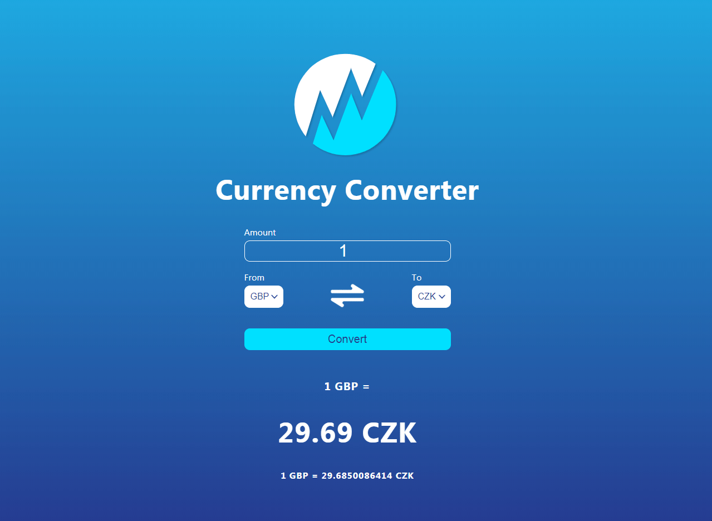

# **Currency Converter**

A simple, responsive web app for converting currencies between two selected countries in real-time.

---

## **Overview**
This application is built with **JavaScript**, **HTML**, and **CSS (Flexbox)**. It uses modern web technologies to deliver a smooth and intuitive user experience. Additionally, all icons (SVG and PNG) were custom-designed in **Adobe Illustrator**.

---

## **Features**
- 🌍 **Dynamic Currency Selection**: Select two countries to get the current exchange rate and convert a specific amount.
- ⚡ **Real-Time Exchange Rates**: Fetches up-to-date rates from [ExchangeRate API](https://api.exchangerate-api.com).
- 🔄 **Swap Functionality**: Quickly swap the selected countries to reverse the exchange direction.
- 🔧 **Interactive Updates**: Values update dynamically as you type in the amount or change the selected countries.
- 🖥️ **Responsive Design**: The layout is styled using **CSS Flexbox** to ensure compatibility across all devices.

---

## **How It Works**
1. Select two countries from the dropdown menus.
2. Enter the amount in one of the input fields.
3. The app will display the converted value in the other field instantly.
4. Click the "Swap" button to reverse the conversion.

---

## **Technologies Used**
- **HTML**: For structuring the UI.
- **CSS (Flexbox)**: For creating a responsive and clean design.
- **JavaScript**: For handling functionality, API integration, and interactivity.
- **Adobe Illustrator**: For designing custom SVG and PNG icons.

---

## **Specifications**
- Display a user interface with:
  - Two dropdowns for country selection.
  - Two input fields for entering amounts.
- Fetch live exchange rates using the [ExchangeRate API](https://api.exchangerate-api.com).
- Automatically update values when:
  - The user changes the input amount.
  - The user swaps the selected countries.
- Provide a responsive design that works on desktop and mobile devices.

---

## **Preview**

---

Feel free to suggest improvements or report any issues! 😊

